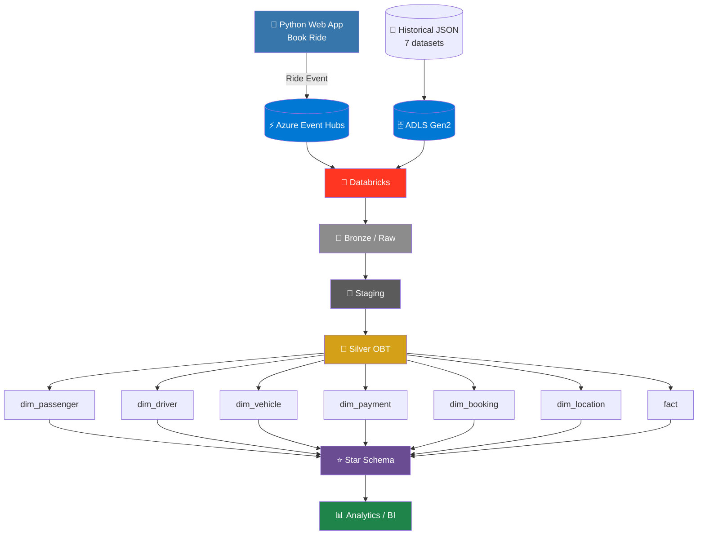
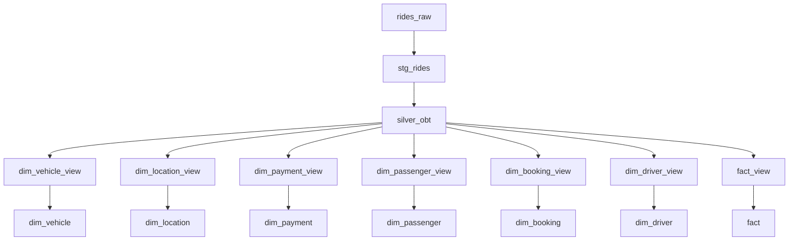
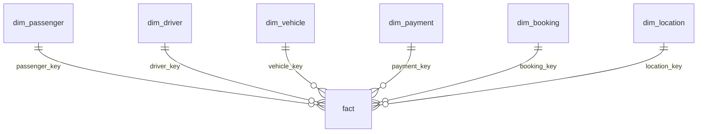
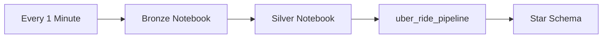
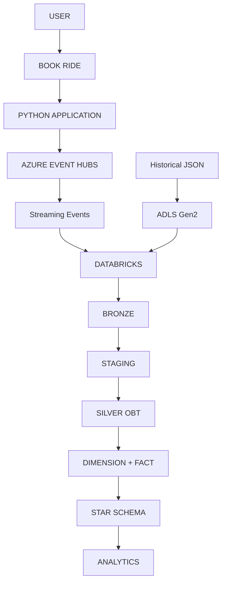

<div align="center">
<!-- Banner -->

<!-- Badges -->
<p>
  
  
  
  
  
  
  
  
  
  
</p>
<!-- Stats -->
<p>
  
  
  
  
  
  
</p>
</div>

<br/>

## Project Architecture


## 📌 Overview

This is an **end-to-end real-time and batch data engineering project** that simulates an **Uber ride-booking platform**, built with Python, Azure Event Hubs, Azure Data Lake Storage Gen2, Databricks, Spark Streaming, a **Silver One Big Table (OBT)**, dimensional **Star Schema** modeling, and **Databricks Jobs** orchestration.

The project captures ride-booking events from a Python web application in real time, ingests historical/reference ride data from JSON files, processes both sources in Databricks, unifies everything into a single **Silver OBT**, and transforms that OBT into a **Star Schema** ready for analytical and BI workloads.

It demonstrates how a modern data platform handles two very different kinds of data at once:

- **Real-time ride-booking events** — generated the moment a user clicks **Book Ride**
- **Historical and reference data** — passengers, drivers, vehicles, cities, payments, and more, maintained as JSON and loaded from ADLS Gen2

```text
Python Web Application
        │
        │ Book Ride Event
        ▼
Azure Event Hubs
        │
        ├─────────────────────────┐
        ▼                         ▼
 Real-Time Events          Historical JSON
        │                         │
        │                         ▼
        │                    ADLS Gen2
        │                         │
        └────────────┬────────────┘
                     ▼
                 Databricks
                     │
                     ▼
                Bronze / Raw
                     │
                     ▼
                  Staging
                     │
                     ▼
                Silver OBT
                     │
        ┌────────────┼────────────┐
        ▼            ▼            ▼
   Dimensions      Fact       Analytical
                                Model
        └──────┬─────┘
               ▼
           Star Schema
               │
               ▼
           Analytics
```

---

## 🎯 Business Problem

Ride-hailing platforms like Uber generate a continuous stream of operational events. Every interaction — booking a ride, selecting a location, choosing a vehicle, picking a payment method, completing or cancelling a ride — produces data, while the platform simultaneously maintains reference information about passengers, drivers, vehicles, locations, payments, bookings, ride statuses, cancellation reasons, vehicle types, vehicle makes, and cities.

Left as disconnected raw streams and independent JSON files, this data is hard to analyze. A business analyst wants to ask questions like:

- Which city has the highest ride demand?
- Which vehicle type is most frequently booked?
- Which payment method is most commonly used?
- How many rides are completed versus cancelled?
- Which drivers are handling the highest number of rides?
- Which passengers generate the most bookings?
- What locations have the highest ride activity?

Answering these directly against raw streaming events and scattered JSON files would mean repeating the same joins and transformations over and over.

**This project solves that** by building a centralized analytical data model: it captures ride events in real time, stores historical/reference data, processes both sources, integrates them into a unified **Silver OBT**, and reshapes that OBT into a **Star Schema** — so the questions above can be answered with simple, reusable queries instead of ad-hoc joins across raw sources.

### Business Requirements

1. Capture ride-booking events in real time
2. Store historical and reference datasets
3. Process both streaming and historical data
4. Combine multiple datasets into a unified business view
5. Clean and transform raw data
6. Create a Silver One Big Table
7. Build reusable analytical dimensions
8. Create a central fact table
9. Provide a Star Schema for analytics
10. Process newly arriving data automatically
11. Orchestrate the entire workflow without manually running notebooks

---

## 🏗️ Architecture



**Major components:**

| # | Component | Role |
|---|---|---|
| 1 | Python Web Application | Generates ride-booking events |
| 2 | Azure Event Hubs | Receives real-time ride events |
| 3 | ADLS Gen2 | Stores historical and reference JSON data |
| 4 | Databricks | Performs distributed processing and transformation |
| 5 | Bronze Layer | Handles raw incoming data |
| 6 | Staging Layer | Prepares data for business transformations |
| 7 | Silver OBT | Combines the required ride information into one unified table |
| 8 | Databricks Streaming Pipeline | Transforms the OBT into analytical datasets |
| 9 | Dimension Tables | Provide descriptive business context |
| 10 | Fact Table | Stores measurable ride events |
| 11 | Star Schema | Provides the final analytical model |
| 12 | Databricks Jobs | Orchestrate the processing every one minute |

---

## 🧠 Core Design

> **Capture ride events → integrate data → create OBT → create Star Schema → make the data analytics-ready.**

Unlike a simple ETL project that copies data from one database to another, this project is **event-driven**: a user action produces an event that flows through ingestion, processing, and modeling layers in near real time.

```text
User clicks "Book Ride"
        │
        ▼
Python Application → Ride Event → Azure Event Hubs

Historical JSON → ADLS Gen2

Event Hubs ────────┐
                   ▼
                Databricks
                   ▲
ADLS Gen2 ─────────┘
```

### Why Real-Time Event Streaming?

A ride-booking system is naturally event-driven — when a customer clicks **Book Ride**, the system should immediately produce an event rather than waiting for a batch to accumulate. This pattern generalizes to ride status changes, driver activity, payment events, cancellations, and location activity.

### Why Azure Event Hubs?

Event Hubs sits between the Python application and Databricks as an **ingestion boundary**, decoupling event producers from event processing — the app only needs to publish the event, not know how it's consumed downstream.

### Why ADLS Gen2?

ADLS Gen2 separates **storage** from **compute**: it retains historical/raw source data durably while Databricks handles processing, keeping the architecture scalable and easier to maintain.

---

## 🐍 Python Web Application

A Python-based web application simulates the front end of the ride-booking system, exposing a **Book Ride** button that, when clicked, creates and publishes a ride event.

```text
Web Application → Book Ride Button → Create Ride Event → Publish Event → Azure Event Hubs
```

The application acts purely as the **event producer**, simulating a real-world app that continuously generates business events.

---

## 📄 Historical & Reference Data

Seven JSON datasets live under `Data/` and are uploaded to ADLS Gen2:

```text
Data/
├── bulk_rides.json
├── map_cancellation_reasons.json
├── map_cities.json
├── map_payment_methods.json
├── map_ride_statuses.json
├── map_vehicle_makes.json
└── map_vehicle_types.json
```

This gives the project **two ingestion patterns** feeding the same processing layer:

```text
                 Data Sources
          ┌──────────┴──────────┐
          ▼                     ▼
   Real-Time Events       Historical Data
          ▼                     ▼
   Azure Event Hubs          ADLS Gen2
          └──────────┬──────────┘
                     ▼
                 Databricks
```

---

## ⚙️ Databricks Processing

Databricks is the central processing platform, responsible for reading, cleaning, transforming, joining, and modeling all data into the final analytical structures.

```text
Raw Data → Bronze → Staging → Silver OBT → Dimensions + Fact → Star Schema
```

### Bronze Layer

Brings incoming data (from both Event Hubs and ADLS Gen2) into the Databricks environment before business transformations are applied — providing traceability, easier debugging, safe reprocessing, and a clean separation between ingestion and transformation.

### Staging Layer

```text
rides_raw → stg_rides
```

Parses incoming records, standardizes columns, handles data types, prepares join keys, and cleans values ahead of integration.

---

## 🥈 Silver One Big Table (OBT)

```text
rides_raw → stg_rides → silver_obt
```

The **OBT** is the most important design decision in the project: a single, centralized, integrated representation of ride data, built once instead of re-joining passenger, driver, vehicle, location, payment, and booking data independently for every downstream table.

```text
Multiple Inputs → Staging → Silver OBT
                                │
                    ┌───────────┼──────────────────────────┐
                    ▼           ▼           ▼        ▼      ▼         ▼
               Passenger     Driver     Vehicle   Location Payment  Booking → Ride Fact
```

**Why OBT before Star Schema?** They serve different purposes:

| Layer | Purpose |
|---|---|
| **Silver OBT** | Integration layer — one centralized business view |
| **Star Schema** | Analytical consumption layer — dimensions + fact for BI |

---

## 🔀 Databricks Streaming Pipeline (Dependency Graph)



The project intentionally uses **view-level transformations** (e.g. `dim_passenger_view` → `dim_passenger`) as a logical layer between the OBT and the final physical tables — the same pattern applies to every dimension and the fact table.

---

## ⭐ Star Schema



| Table | Description | Answers |
|---|---|---|
| `dim_passenger` | Customer/passenger information | Top passengers by ride count, booking behavior, ride frequency |
| `dim_driver` | Driver-related information | Driver ride volume, activity, completed rides by driver |
| `dim_vehicle` | Vehicle characteristics (`map_vehicle_makes.json`, `map_vehicle_types.json`) | Most popular vehicle type/make, ride demand by vehicle |
| `dim_payment` | Payment attributes (`map_payment_methods.json`) | Most-used payment method, ride distribution by payment |
| `dim_booking` | Booking-related attributes | Booking volume, outcomes, conversion patterns |
| `dim_location` | Geographic information (`map_cities.json`) | Highest-demand cities, pickup/drop hotspots, geographic distribution |
| `fact` | Measurable ride-related events | Ride count, completed/cancelled rides, time-based ride analysis |

**Why fact and dimensions?**

```text
WHAT HAPPENED?         →  FACT (Ride Event)
WHO / WHAT / WHERE?    →  DIMENSIONS (Passenger, Driver, Vehicle, Payment, Booking, Location)
```

---

## ⏱️ Databricks Jobs Orchestration

The workflow runs automatically via **Databricks Jobs**, scheduled every **one minute**:



| Stage | Notebook | Responsibility |
|---|---|---|
| 1 | Bronze Notebook | Processes incoming raw data into Bronze |
| 2 | Silver Notebook | Prepares staging / Silver OBT |
| 3 | `uber_ride_pipeline` | Builds dimension views/tables and the fact view/table → final Star Schema |

**Why one minute?** It simulates a near-real-time analytics experience — the platform checks for new data frequently (`17:00 → run`, `17:01 → run`, `17:02 → run`...) instead of waiting for a daily or hourly batch, which fits a use case where ride events arrive continuously.

---

## 🔄 Complete Data Lifecycle

```text
 1. User opens Web Application
 2. User clicks Book Ride
 3. Python generates ride event
 4. Event is published to Event Hubs
 5. Historical JSON data is available in ADLS
 6. Databricks processes incoming data
 7. Bronze processing
 8. Staging transformation
 9. Silver OBT creation
10. OBT feeds analytical views
11. Dimension and fact tables are created
12. Star Schema becomes available
13. Data is ready for analytics
```

---

## 🧩 Data Engineering Patterns Demonstrated

| Pattern | Description |
|---|---|
| **Event-Driven Architecture** | Ride events generated by the app, published to Event Hubs |
| **Streaming Data Ingestion** | Continuously generated ride events processed in near real time |
| **Batch Data Processing** | Historical JSON datasets processed from ADLS |
| **Hybrid Architecture** | Streaming + Batch combined in a single platform |
| **Medallion-Style Processing** | Bronze → Silver before analytical modeling |
| **One Big Table** | Silver OBT as centralized business integration layer |
| **Dimensional Modeling** | OBT transformed into dimensions and a fact table |
| **Star Schema** | Final analytical structure for BI consumption |
| **Job Orchestration** | Databricks Jobs automate recurring execution |

---

## 📂 Repository Structure

```text
uber-streaming-pipeline/
│
├── Data/
│   ├── bulk_rides.json
│   ├── map_cancellation_reasons.json
│   ├── map_cities.json
│   ├── map_payment_methods.json
│   ├── map_ride_statuses.json
│   ├── map_vehicle_makes.json
│   └── map_vehicle_types.json
│
├── dataset/
│   ├── Json_adls_ds.json
│   ├── Json_github_ds.json
│   └── ds_ingest.json
│
├── factory/
│   └── projectuberadf.json
│
├── linkedService/
│   ├── AzureDataLakeStorageLS.json
│   └── HttpLS.json
│
├── pipeline/
│   └── httpToAdls.json
│
├── templates/
│   ├── confirmation.html
│   └── home.html
│
├── uber_project/
│   └── uber_ride_pipeline/
│       │
│       ├── explorations/
│       │   └── sample_exploration.py
│       │
│       ├── transformations/
│       │   ├── ingestion.py
│       │   ├── model.py
│       │   ├── silver.py
│       │   └── silver_obt.sql
│       │
│       ├── utilities/
│       │   └── utils.py
│       │
│       ├── README.md
│       ├── bronze_adls.ipynb
│       └── silver_obt.ipynb
│
├── Screenshots/
│   └── project screenshots
│
├── .env_example
├── .gitignore
├── .python-version
├── LICENSE
├── README.md
├── api.py
├── connection.py
├── data.py
├── publish_config.json
├── pyproject.toml
└── requirements.txt
```

### Directory Reference

| Path | Purpose |
|---|---|
| `Data/` | Seven JSON datasets providing historical ride data and reference information |
| `dataset/` | Configured dataset definitions used in the data ingestion setup |
| `factory/projectuberadf.json` | Factory-level pipeline configuration |
| `linkedService/` | Service connection definitions (ADLS, HTTP) — no secrets committed directly |
| `pipeline/httpToAdls.json` | Configured data movement pipeline |
| `templates/` | HTML templates (`home.html`, `confirmation.html`) for the Python web app UI |
| `uber_project/uber_ride_pipeline/` | The core Databricks project — the heart of the data processing |
| `explorations/sample_exploration.py` | Exploratory development and analysis code |
| `transformations/ingestion.py` | Ingestion-related processing logic |
| `transformations/model.py` | Data modeling logic |
| `transformations/silver.py` | Silver-layer transformation logic |
| `transformations/silver_obt.sql` | SQL logic for the Silver OBT |
| `utilities/utils.py` | Reusable helper functions shared across the project |
| `bronze_adls.ipynb` | Bronze processing notebook |
| `silver_obt.ipynb` | Silver OBT notebook — builds the unified ride table |
| `Screenshots/` | Project and architecture screenshots for documentation |
| `api.py` | Application/API-related functionality |
| `connection.py` | Connection-related functionality |
| `data.py` | Data-related application logic |
| `publish_config.json` | Publishing/configuration information |
| `requirements.txt` | Python dependencies |
| `pyproject.toml` | Python project configuration and build/dependency info |
| `.env_example` | Example environment variables (actual secrets stay in local `.env`, never committed) |
| `LICENSE` | Project license (MIT) |

---

## 🛠️ Technology Stack

| Category | Technology |
|---|---|
| Application | Python |
| Web Application | Python Web Framework |
| Event Producer | Python Application |
| Real-Time Ingestion | Azure Event Hubs |
| Cloud Storage | Azure Data Lake Storage Gen2 |
| Processing Platform | Azure Databricks |
| Processing Engine | Apache Spark |
| Streaming Processing | Databricks Streaming |
| Transformation | PySpark / Python / SQL |
| Integration Layer | Silver OBT |
| Data Modeling | Star Schema |
| Dimensions | Passenger, Driver, Vehicle, Payment, Booking, Location |
| Fact | Ride Fact |
| Orchestration | Databricks Jobs |
| Scheduling | Every 1 Minute |
| Source Format | JSON |
| Version Control | Git / GitHub |

---

## ✅ Business Analytics Enabled

| Analysis Area | Example Questions |
|---|---|
| **Ride Volume** | How many rides generated / completed / cancelled? How does volume trend over time? |
| **Passenger** | Top passengers by ride count, booking behavior, ride frequency |
| **Driver** | Driver ride volume, activity, completed rides by driver |
| **Vehicle** | Most popular vehicle types, usage, make distribution |
| **Payment** | Payment method distribution, most frequently used methods |
| **Location** | Highest-demand cities, popular pickup/drop locations, geographic distribution |
| **Booking** | Booking volume, booking outcomes, ride conversion patterns |

---

## 🧗 Project Challenges Solved

| Challenge | Problem | Solution |
|---|---|---|
| **Real-Time Event Capture** | Ride-booking events generated continuously | Python → Azure Event Hubs decouples event generation from downstream processing |
| **Historical Data Integration** | Historical/reference datasets exist separately from streaming events | Store JSON in ADLS Gen2, integrate during Databricks processing |
| **Multiple Data Relationships** | Ride data relates to passengers, drivers, vehicles, locations, payments, bookings | Centralize everything into a Silver OBT before analytical modeling |
| **Analytical Consumption** | A large integrated table isn't ideal for analytics | Transform the OBT into Dimensions + Fact = Star Schema |
| **Manual Processing** | Manually running Bronze/Silver/final transforms is inefficient | Databricks Jobs on a 1-minute schedule automate the whole workflow |

---

## 📈 Scalability & Fault Isolation

```text
More Users → More Ride Events → Higher Event Hub Throughput
    → More Streaming Data → Databricks Distributed Processing
    → Scalable Analytical Tables
```

Databricks and Spark provide distributed processing so the transformation layer scales with event volume. Components are also isolated — if downstream analytical transformation temporarily fails, Event Hubs ingestion remains unaffected, and historical ADLS data can be reprocessed independently, which keeps debugging and recovery straightforward.

---

## 🚀 Future Improvements

- **Real-Time Dashboard** — connect the Star Schema to Power BI, Databricks SQL, or Tableau
- **Data Quality Framework** — automated validation for nulls, duplicates, invalid passenger/driver IDs, invalid locations, payment methods, and ride statuses
- **Advanced Streaming** — event-time processing, watermarking, late-arriving event handling, checkpointing, stateful streaming, streaming aggregations
- **Monitoring** — event ingestion rate, processing latency, failed jobs, records processed, pipeline/data-quality failures
- **CI/CD** — GitHub Actions to automate commit → test → validate → deploy to Databricks
- **Infrastructure as Code** — provision Azure resources via Terraform or Azure Bicep

---

## 🧑‍💻 Project Skills Demonstrated

`Python` · `Web Application Development` · `Event-Driven Architecture` · `Azure Event Hubs` · `Azure Data Lake Storage Gen2` · `Databricks` · `Apache Spark` · `Spark Streaming` · `Databricks Streaming Tables/Pipelines` · `Batch Processing` · `Real-Time Data Ingestion` · `JSON Processing` · `Bronze/Silver Architecture` · `One Big Table` · `Dimensional Modeling` · `Star Schema` · `Fact & Dimension Tables` · `SQL Transformations` · `PySpark` · `Databricks Jobs` · `Pipeline Orchestration` · `Cloud Data Engineering` · `Git/GitHub`

---

## 🏁 Project Outcome



The project delivers a complete end-to-end ride data engineering platform, connecting a **Python application**, **Azure Event Hubs**, **ADLS Gen2**, **Databricks**, **Spark Streaming**, **Bronze processing**, a **Silver OBT**, a **Star Schema**, and **Databricks Jobs** into one system. The key achievement is integrating real-time event generation, cloud event ingestion, historical data processing, unified OBT creation, dimensional modeling, and automated orchestration into a single end-to-end data engineering project — turning application-generated events and historical datasets into a structured analytical model suitable for business intelligence.

---

## 📄 License

This project is licensed under the terms defined in [LICENSE](LICENSE).
